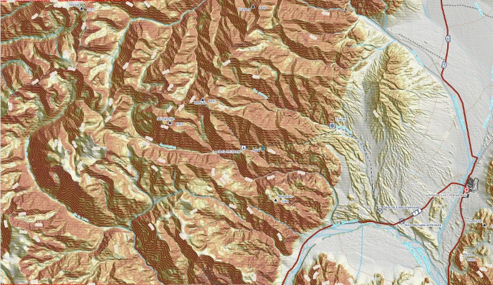

## Mendoza. Cerro Montura.
## Zona en 3D
.jpg)

## Así va saliendo el mapa:
Zona de salida para el curso del [ICABA](https://www.caba.org.ar/historia/70-instituto-superior-de-alta-montana/303-charla-informativa-tecnicatura-sup-en-guia-de-montana)

Archivos vectoriales de los POI, senderos, curvas de nivel, y todos los vectoriales del IGN (Instituto Geográfico Nacional de Argentina) recortados a la zona cartografiada. y mucho mas

